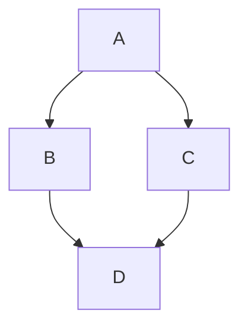
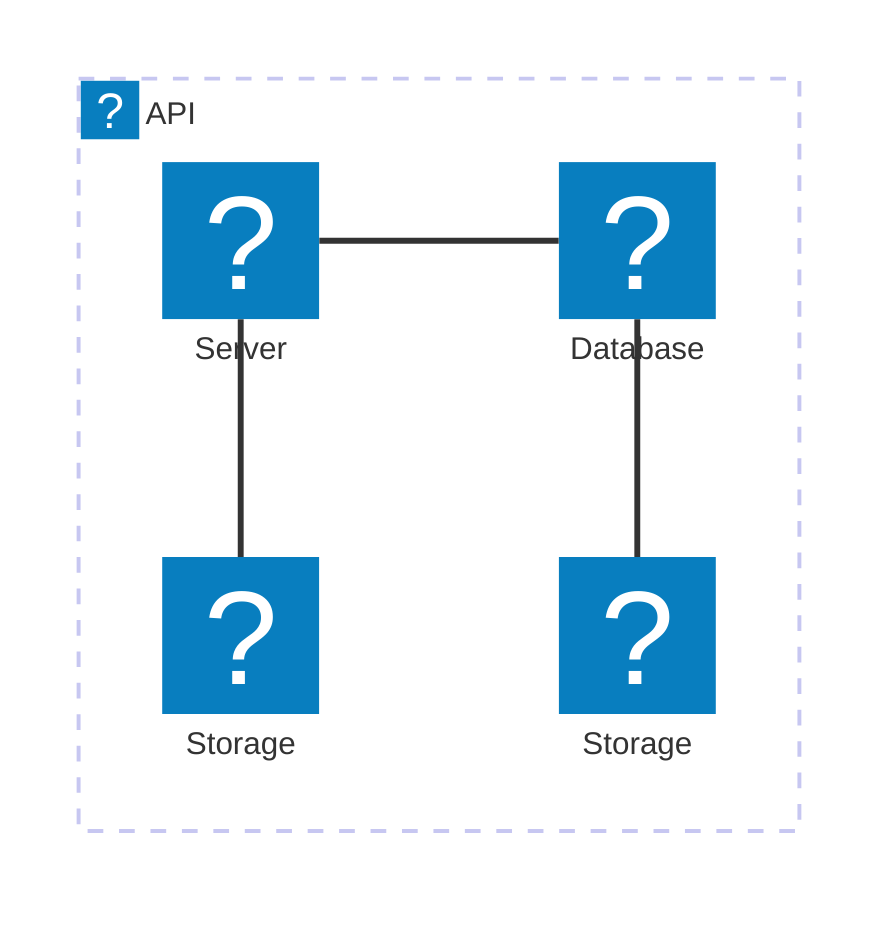

```mermaid
graph TD;
    accTitle: the diamond pattern
    accDescr: a graph with four nodes: A points to B and C, while B and C both point to D
    A-->B;
    A-->C;
    B-->D;
    C-->D;
```

```mermaid
architecture-beta
    accTitle: the architecture
    accDescr: a architecture graph with four nodes
  group aws-services(aws:aws)[AWS Services] {
    service lambda(aws:aws-lambda)[Lambda]
    service s3(aws:amazon-simple-storage-service)[S3]
    service ec2(aws:aws-ec2)[EC2]
    service rds(aws:amazon-rds)[RDS]
  }

    service db(database)[Database] in api
    service disk1(disk)[Storage] in api
    service disk2(disk)[Storage] in api
    service server(server)[Server] in api

    db:L -- R:server
    disk1:T -- B:server
    disk2:T -- B:db
```

```mermaid
architecture-beta
    group api(logos:aws-lambda)[API]

    service db(logos:aws-aurora)[Database] in api
    service disk1(logos:aws-glacier)[Storage] in api
    service disk2(logos:aws-s3)[Storage] in api
    service server(logos:aws-ec2)[Server] in api

    db:L -- R:server
    disk1:T -- B:server
    disk2:T -- B:db
```
