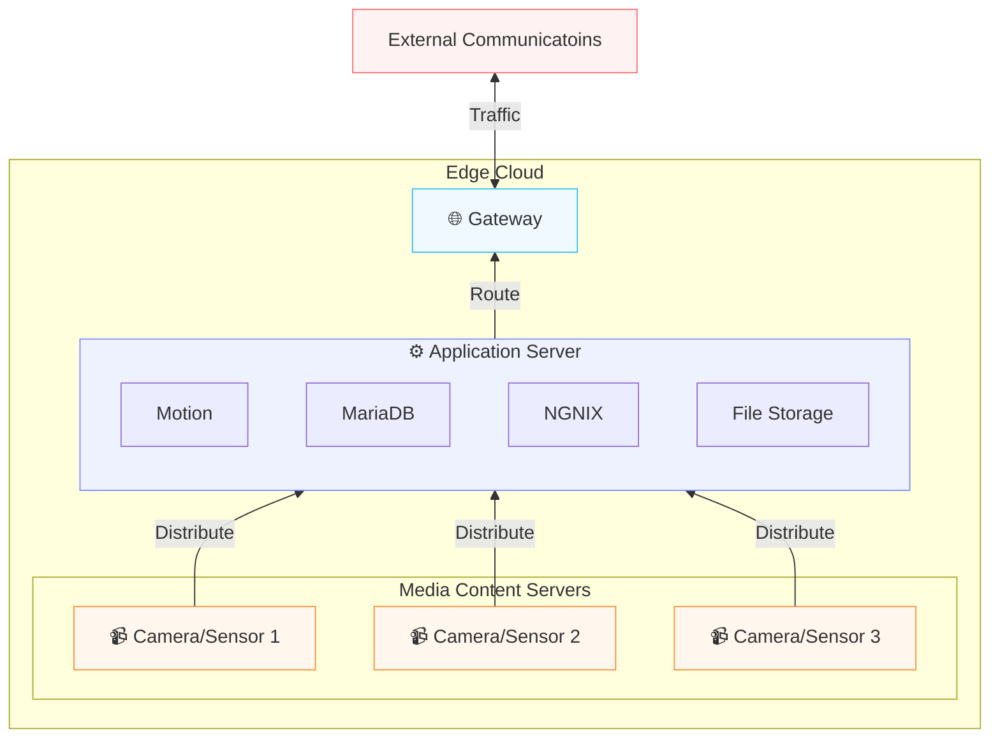

```mermaid
flowchart BT
 subgraph mediaServers["Media Content Servers"]
        media1["📹 Camera/Sensor 1"]
        media2["📹 Camera/Sensor 2"]
        media3["📹 Camera/Sensor 3"]
  end
 subgraph appServer["⚙️ Application Server"]
        server1["Motion"]
        database["MariaDB"]
        server2["NGNIX"]
        server3["File Storage"]
  end
 subgraph vpc["Edge Cloud"]
    direction BT
        igw["🌐 Gateway"]
        appServer
        mediaServers
  end
    igw <-- Traffic --> internet["External Communicatoins"]
    appServer -- Route --> igw
    media1 -- Distribute --> appServer
    media2 -- Distribute --> appServer
    media3 -- Distribute --> appServer

     media1:::mediaStyle
     media1:::mediaStyle
     media2:::mediaStyle
     media2:::mediaStyle
     media3:::mediaStyle
     media3:::mediaStyle
     igw:::gatewayStyle
     appServer:::appStyle
     internet:::internetStyle
    classDef vpcStyle stroke:#2dd4bf,fill:#f0fdfa
    classDef gatewayStyle stroke:#38bdf8,fill:#f0f9ff
    classDef appStyle stroke:#818cf8,fill:#eef2ff
    classDef mediaStyle stroke:#fb923c,fill:#fff7ed
    classDef internetStyle stroke:#f87171,fill:#fef2f2

```
