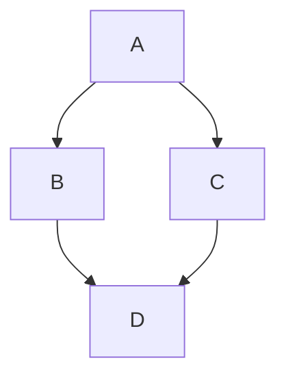

```mermaid
<script type="module">
  import mermaid from 'https://cdn.jsdelivr.net/npm/mermaid@11/dist/mermaid.esm.min.mjs';

  mermaid.registerIconPacks([
    {
      name: 'logos',
      loader: () =>
        fetch('https://unpkg.com/@iconify-json/logos@1/icons.json')
          .then(res => res.json())
    }
  ]);

  mermaid.initialize({ startOnLoad: true });
</script>

architecture-beta
  subgraph AWS
    ELB[img:logos:aws-elb]
    EC2[img:logos:aws-ec2]
    RDS[img:logos:aws-rds]
  end
  ELB --- EC2 --- RDS
    
```
